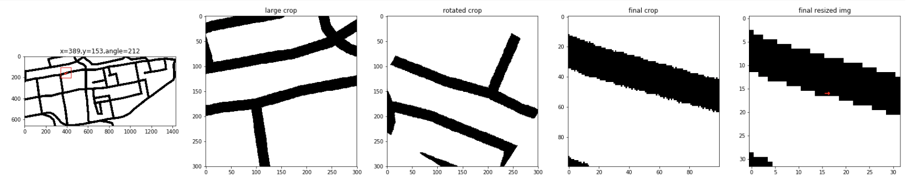
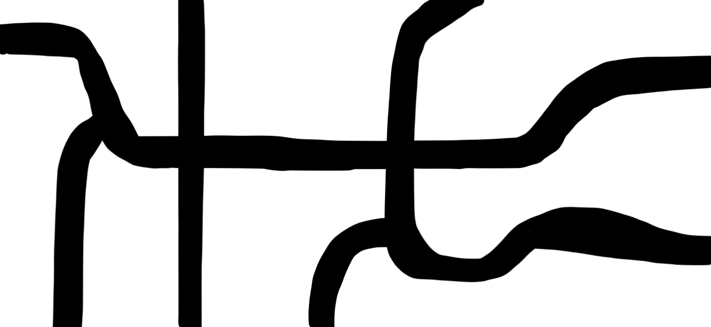

#  AutoDrivingCarT3D
Simple auto driving car using T3D Reinforcement learning

# How to run
* Because of unavailability of GPU on my desktop, i have trained it on Google Colab. But running Kivy on colab is very complex, hence once training is done on Colab, model is downloaded to pytorch_models directory and then it is run on my local desktop.
* Use `AutoDrivingCarT3D.ipynb` to train on Colab
* For inference, run: `python carkv.py`

# Understanding Implementation
* Because we can't run Kivy on Colab and because we don't have GPUs on our desktop, following is the strategy to train
  * Load the sand image and move the coordinates (Vector) in env.Step() for simulating car movement.
  * State is captured by cropping a portion of sand image from car's position. And then rotating it in the direction of the car in such a way that car's orientation is horizontal i.e 0 degrees from x-axis. This state is passed to Actor network
  * Action is 1 dimensional, with its value being amount of angle the car should rotate

# Network Architecture
* We build one neural network for the Actor model and one neural network for the Actor target
* We use MobileNet for this implementation as we don't need very complex network and also the network should have good speed

# About the environment
* We simulate Kivy environment here. As Kivy doesn't do much apart from Graphics
* We maintain x,y position and car's angle. This is rotated based on action
* Action here is one-dimensional, which is the amount of degrees the car should rotate
* If x,y position is on sand, we set a small velocity, else a slightly high velocity
* Our state here corresponds to the cropped portion of current postion as center. This image is rotated to be in the direction of car. This was our network understands car's orientation
* Cropping here is done differently. If we directly crop and rotate the image, we may loose information from the edges. Hence we do the following:
  * Crop a larger portion of image
  * Rotate it to make the cropped image in the direction of car's orientation
  * Then crop it to required size
  

# Image handling between PIL vs Numpy vs Kivy
* One of the most frustrating part of image handling here is between different frameworks
* PIL reads image in (width, height) format with (0,0) coordinates starting from top left i.e. x-axis 0 to max goes from left to right. But y-axis 0 to max goes from top to left
* Numpy reads image in (height, width) format with (0,0) coordinates starting from top left like PIL
* Kivy reads image in (width, height) format with (0,0) coordinates starting from bottom left

# ToDo Items
* Yet to acheive satisfactory results
* Find optimal rewards distribution is challenging and needs more work
* One way is to perform the training step-by-step in following order:
  * Train for car to reach a destination with no sand in map:
    >
    
    * This catches any silly mistakes in the network and also gives a fair understanding of rewards required for such basic problem
    
  * Train for car to stay on road with map being filled with wide roads:
    
    >
    
  * Then train for final map:
    
    >
* Other thing to experiment with is to increase network parameters. Maybe small network is not sufficient
