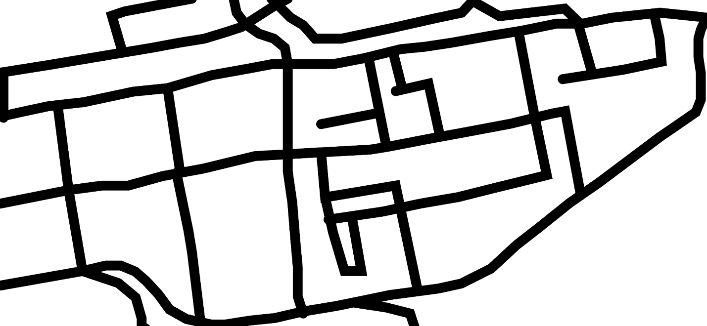

#  AutoDrivingCarT3D
Simple auto driving car using T3D Reinforcement learning

# How to run
* Because of unavailability of GPU on my desktop, i have trained it on Google Colab. But running Kivy on colab is very complex, hence once training is done on Colab, model is downloaded to pytorch_models directory and then it is run on my local desktop.
* Use `AutoDrivingCarT3D.ipynb` to train on Colab
* For inference, run: `python carkv.py`

# Understanding Implementation
* Because we can't run Kivy on Colab and because we don't have GPUs on our desktop, following is the strategy to train the network
  * Load the sand image and move the coordinates (Vector) in env.step() for simulating car movement.
  * State is captured by cropping a portion of sand image from car's position. And then rotating it in the direction of the car in such a way that car's orientation is horizontal i.e 0 degrees from x-axis. Also, car's distance and orientation is taken as part of state, which is normalized to be in range (-1, +1). This state is passed to Actor network
  * Action is 1 dimensional, with its value being amount of angle the car should rotate

# Learnings
### Image handling between PIL vs Numpy vs Kivy
* One of the biggest thing was coordinate axes in PIL, Numpy & Kivy. Here's the difference:
  * PIL reads image in (width, height) format with (0,0) coordinates starting from top left i.e. x-axis 0 to max goes from left to right. But y-axis 0 to max goes from top to left
  * Numpy reads image in (height, width) format with (0,0) coordinates starting from top left like PIL
  * Kivy reads image in (width, height) format with (0,0) coordinates starting from bottom left
### Breaking the problem into smaller problems
* Since the objective is for the car to reach a goal by only driving on road and not on sand, we break it down into two problems:
  1. Make car reach destination with no sand/road taken into consideration
    >
    
    * This catches any silly mistakes in the network and also gives a fair understanding of rewards required for such basic problem
  2. Make car reach destination with sand/road taken into consideration
    >
* Other thing to experiment with is to increase network parameters. Maybe small network is not sufficient
### Hyper parameters selection
* Selection of `start_timesteps` (i.e. initials steps to fill replay memory) is done by viewing the number of points it covers. In this case, i found that 2e4 covered enough random points
* Max action here is the maximum angle the car can rotate. Initially i set it to 5 degrees i.e. (-5 to +5). But then observed that this caused lots of rotation in circles (aka Ghoomar or Shaktiman move). We good rendering of state in my code i observed that this angle has to increase. Hence increased it to 30 degrees, this avoided the rotation in circles issue

# State definition
* One of the most important task is to define our state here. Initially i just considered cropped image of car, rotated in the direction of car as input to that network. But then once i broken the problem down into subset of two problems i figured that state did not cover how to reach goal
* Hence, i first worked on making car reach destination with no sand/road taken into consideration. Here i figured the following as the state input:
  * Distance from Goal: This measures the distance between car and the goal. This is divided by maximum possible distance to normalize it to be in range (0,1). This gives network an idea of where the car is positioned with respect to the destination
  * +Orientation: This is the orientation of the car with respect to the destination. This is divied by 180 degrees to normalize it in range (-1, 1). This gives network an idea of the direction of the destination
  * -Orientation: Same as above, but negative of it. This for some reason improves network accuracy
* Here's a sample execution of car's path for above simplified problem:

* Next was figuring out a state to keep car on road and avoid sand. This corresponds to the cropped portion of current postion as center. This image is rotated to be in the direction of car. This is rotation helps network understand car's angle
* Cropping here is done differently. If we directly crop and rotate the image, we may loose information from the edges. Hence we do the following:
  
  * Crop a larger portion of image
  * Rotate it to make the cropped image in the direction of car's orientation
  * Then crop it to required size
* Following is a comparison of cropped image and original image
  

# Network Architecture
* We build one neural network for the Actor model and one neural network for the Actor target
* We use MobileNet for this implementation as we don't need very complex network and also the network should have good speed

# About the environment
* We simulate Kivy environment here. As Kivy doesn't do much apart from Graphics
* We maintain x,y position and car's angle. This is rotated based on action
* Action here is one-dimensional, which is the amount of degrees the car should rotate
* If x,y position is on sand, we set a small velocity, else a slightly high velocity

# Conclusion
* Although i didn't achieve satisfactory result even after spending 4 weeks on it, i have learnt a lot here
* Approaching a problem should always involve clear thinking on what we want our network to achieve
* Also we must think from network's perspective, that given an input/state does it have enough information there to figure out desired actions
* If possible, always break problems into smaller pieces. This helps a lot, i can't stress this any better
* Always verify all the nitty gritties in the code, for example here the coordinate system was very tricky to handle
